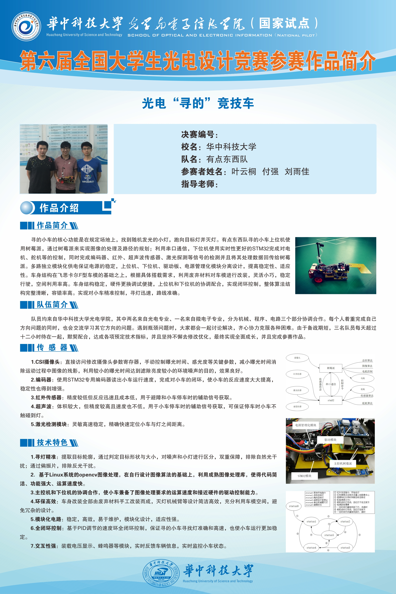
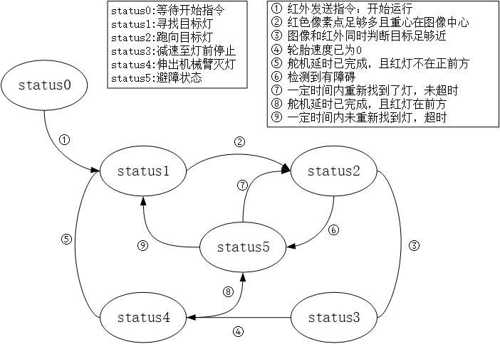
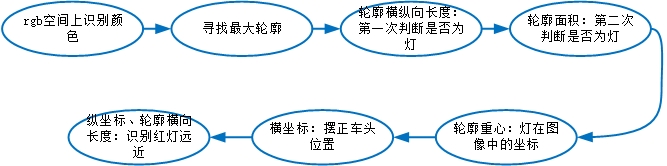
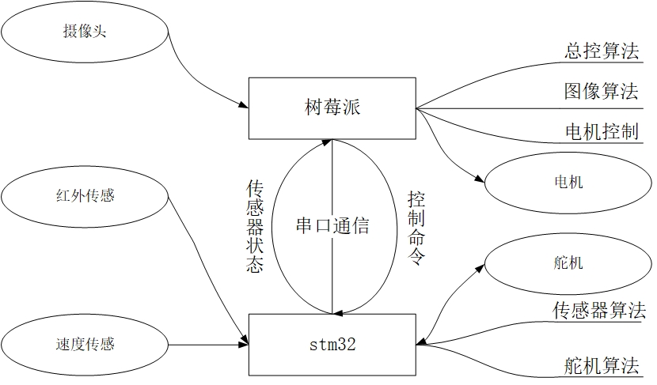

# Searching the Light: Smart Car

This is a project for the 6th National University Students' Opt-Sci-Tech Competition in 2018. We finally won the **3rd prize**.

## Task

In the competition one of 12 lights is randomly turned on in given time. The task of the smart car is to run towards the shining light and put out the light.

## Demo

    
     
    
Demo

## Team

## Status Diagram

## Searching the Light

## Controlling System

## Env

- This project is implemented on Raspberry Pi for the motion strategy  and the image processing, while the motor control is implemented on STM32.
- The codes on Raspberry Pi have dependency on Python3 and Opencv 3.4

## Author

Yuntong Ye (yuntongye@outlook.com)
Qiang Fu
Yujia Liu